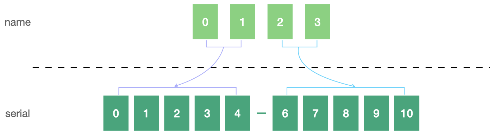
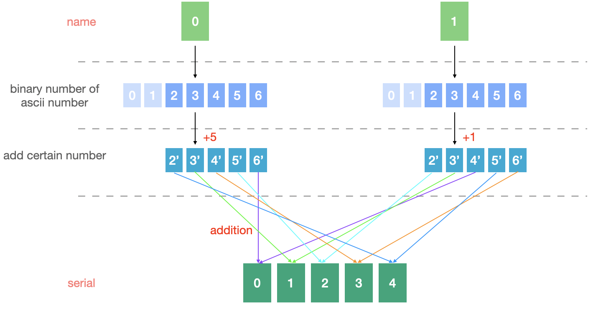

# Position

## Description
程式會要求輸入 name, serial，然後根據兩者在下面顯示 `Wrong` 或 `Correct!`，而本題的目標就是找到相對應 `76876-77776` 的 name，且其最後一個字母為 **p**。  

## 分析
### static analysis
1. 用 **detect it easy** 可以發現他有用 `MFC` framework，基本上所有的
2. 從 `Imports` subview 找特殊的 API function，找到 `GetWindowTextW` 猜測應該是用其來取得 input 的 name, serial，用 xref 可以找出其是在 `sub_401740` 被使用到
#### 分析 `sub_401740`
> 根據 input name，算出相應的 serial 並與輸入比對

- 限制
  - name
    - 長度為 **4**
    - 其 ascii 需在 `0x61 ~ 0x7A`，即英文字母小寫
    - 沒有重複的字母
  - serial
    - 長度為 **11**
    - 第 6 個字母需為 `-`

利用 name 中字母 ascii 的二進制表示算出 serial，將 name 的字母分為兩兩一組計算，兩個字母算出相對應的五個數字。

##### 計算邏輯
1. 以兩個字母為一組，將 name 的 ascii number 轉換為二進制
2. 僅保留二進制表示的五個低位數字（因其 name 的範圍限制，前兩位皆為 `11`）
3. 第一個字母相對應的每一個數字都加上 **5**，第二個字母相對應的每一個數字都加上 **1**
4. 根據下圖的方式，相加上一步驟所計算的數值
   

## Solution
根據[計算邏輯](#計算邏輯)，最後 serial 中，只有可能出現 `6, 7, 8` 三個數字，而當其值為 `6, 8` 時，name 中兩個字母相應的位置便可以直接確定；計算只會使用到二進制的轉換和加法，因此，可用簡單的方式計算回去。  
由於，name 的最後一個數值已經確定為 `p`，因此便可計算出倒數第二碼所對應的最低位的五碼為 `01101`，便可輕鬆的計算出相對應的字母。  
而前兩個字母對應到的 serial 為 `77776`，所以只能確定第一個字母的二進制表示應為 `1100?1?`，而第二個的為 `1110?0?`，兩個都有相對應 4 個可能的字母，根據所有的組成算出其相應的 serial，可得到四組 input name 可以取得目標的 serial，然而有一組包含了重複的字母，因此共有 3 組 input name 是目標的解答。